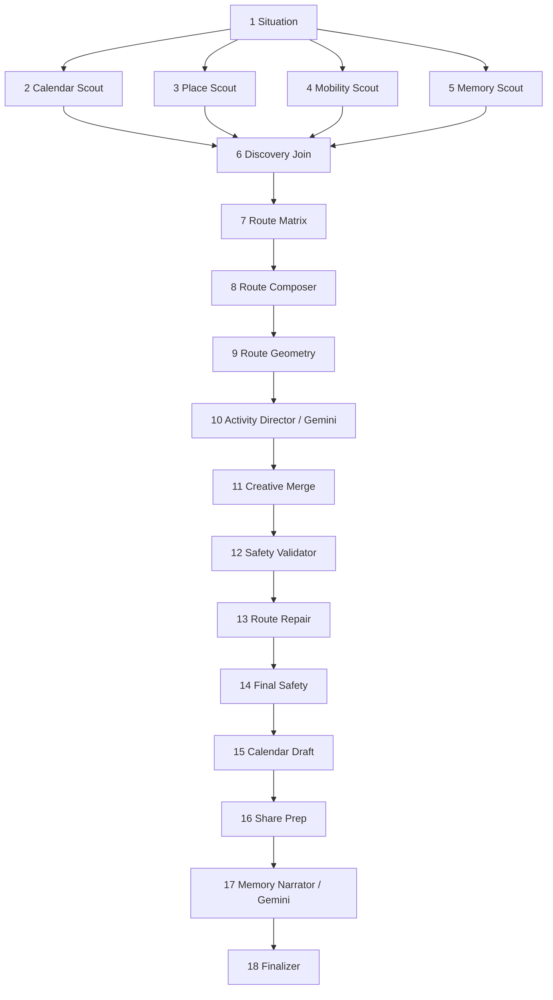
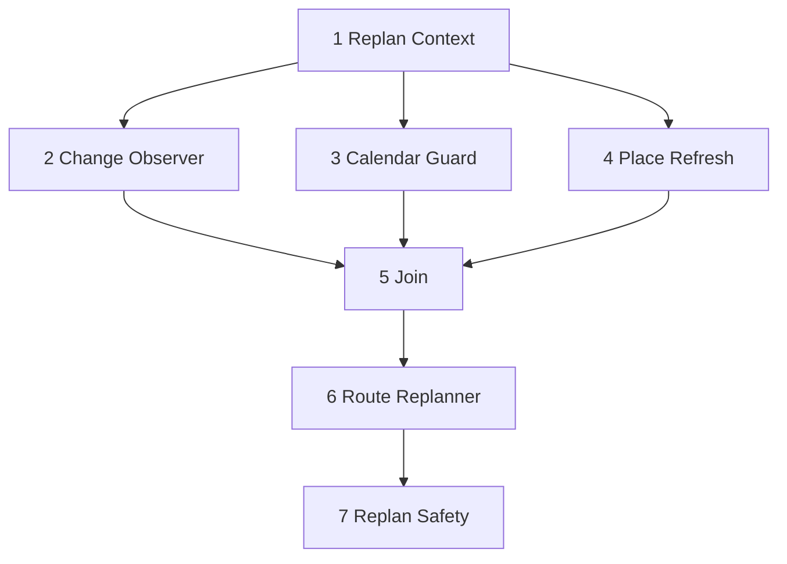

# Google ADK エージェント設計

## 1. 方針

MICHIKUSAは、LLMへ全処理を委ねる単一エージェントではありません。Google ADKのグラフで、生成が向く判断と、コードで検査する処理を分けています。

- Gemini: 短い現地アクティビティと共有用の呼び名
- 決定的処理: 時刻、距離、予算、営業、安全、Calendarイベント
- 外部ツール: Places、Routes、Calendar
- Human in the loop: Calendar書き込み前の「この道草で出発」

## 2. 計画グラフ: 18ノード



### 各ノード

| # | ノード | 入力 | 出力 |
|---:|---|---|---|
| 1 | Situation | 現在地、ホーム、時刻 | departure / detour |
| 2 | Calendar Scout | Calendar busy、希望時間 | 使用可能な時間窓 |
| 3 | Place Scout | 現在地、半径、予算 | 営業中候補 |
| 4 | Mobility Scout | 時間、移動手段 | 半径、地点数 |
| 5 | Memory Scout | 過去のPlan | 重複回避情報 |
| 6 | Discovery Join | 並列結果 | 統合状態 |
| 7 | Route Matrix | 候補、現在地 | 移動時間指標 |
| 8 | Route Composer | 指標、条件 | 2〜4地点の下書き |
| 9 | Route Geometry | 下書き | Routes経路、距離、Polyline |
| 10 | Activity Director | 地点と役割 | 各地点の短い遊び |
| 11 | Creative Merge | RouteとActivity | 一体化した体験 |
| 12 | Safety Validator | Route | 時間、予算、営業、夜間検査 |
| 13 | Route Repair | 不合格箇所 | 必要部分だけ修正 |
| 14 | Final Safety | 修正後Route | 最終判定 |
| 15 | Calendar Draft | Route | travel / spot / returnイベント |
| 16 | Share Prep | Route | 正確な住所を含まない共有情報 |
| 17 | Memory Narrator | 体験要約 | 呼び名、テーマ |
| 18 | Finalizer | 全状態 | MichikusaPlan |

## 3. 経路選定

候補の評価軸:

```text
評価 =
  評価値          20%
  新規性          32%
  移動しやすさ    22%
  予算適合        12%
  役割適合        14%
  + 経路連続性の補正
```

安全や実行可能性は得点ではなく除外条件です。

- 閉店
- 予算超過
- 次の予定に間に合わない
- 夜遅い屋外地点
- 移動時間を含めると帰宅余白が消える

地点は、常に直前地点からの距離で再評価します。これにより、現在地から見れば近いが互いには遠い候補をつないだジグザグ経路を防ぎます。

## 4. 再計画グラフ: 7ノード



### 理由別の動作

| 理由 | 動作 |
|---|---|
| delay | 滞在を短縮し、必要なら最後の地点を外す |
| closed | 未訪問地点を近い代替候補へ変更する |
| tired | 休憩地点を残し、地点数と移動を減らす |
| go_home | 未訪問地点を削除し、帰宅イベントだけを残す |

完了済み地点、獲得LUCK、元の帰宅上限は保持します。

## 5. Calendar実行グラフ: 4ノード

1. Calendar Auth: access tokenと承認状態を確認
2. Calendar Container: MICHIKUSA専用Calendarを決定
3. Calendar Action: 作成または既存イベント更新
4. Calendar Receipt: IDs、リンク、件数を返す

Calendar実行はPlan作成時ではなく、ユーザーが出発を承認した後に呼びます。

## 6. NDJSONイベント

```json
{"type":"run_started","planning_nodes":18}
{"type":"trace","trace":{"agent":"place_scout_agent","status":"running"}}
{"type":"candidate","candidate":{"place_id":"..."}}
{"type":"pin","stop":{"id":"spot-1","order":1}}
{"type":"plan","plan":{"id":"...","stops":[...]}}
```

UIはAgentの内部思考を表示しません。外部から確認できる作業単位、処理状態、件数だけを表示します。

## 7. フォールバック

- Gemini未設定: `DemoMichikusaModel`が同じ構造化出力を返す。
- Maps未設定: 現在地から相対配置したデモ候補を返す。
- Routes未設定: Haversine距離と歩行速度で推定する。
- 実API実行中に失敗: 警告イベントを出し、同じグラフをデモデータで再実行する。

## 8. 評価

自動検査は、文章の似具合より実行可能性を見ます。

- Planが生成される。
- 標準時間で2〜4地点になる。
- `end_at <= return_by`。
- 全地点のLUCK合計がPlanと一致する。
- Calendar下書きが生成される。
- 安全検査が通る。
- 再計画後も上記条件を守る。
