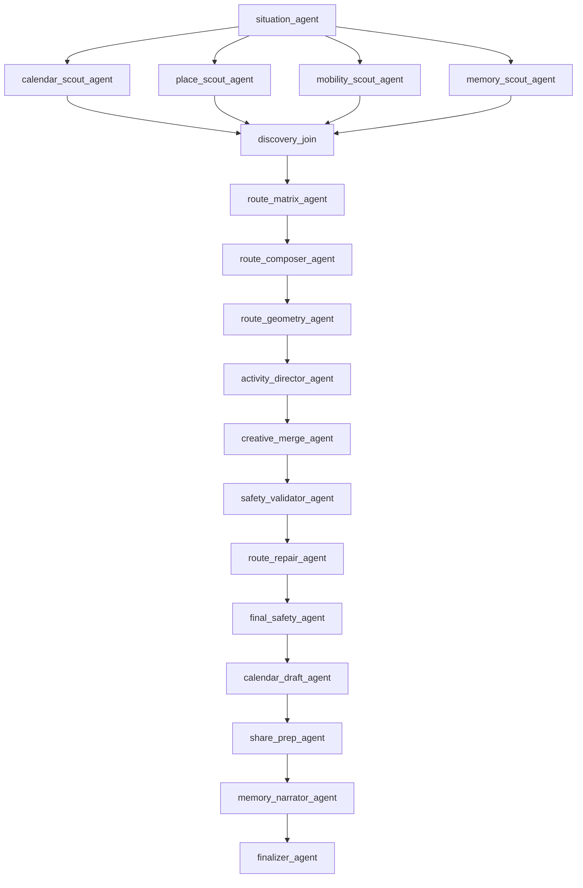
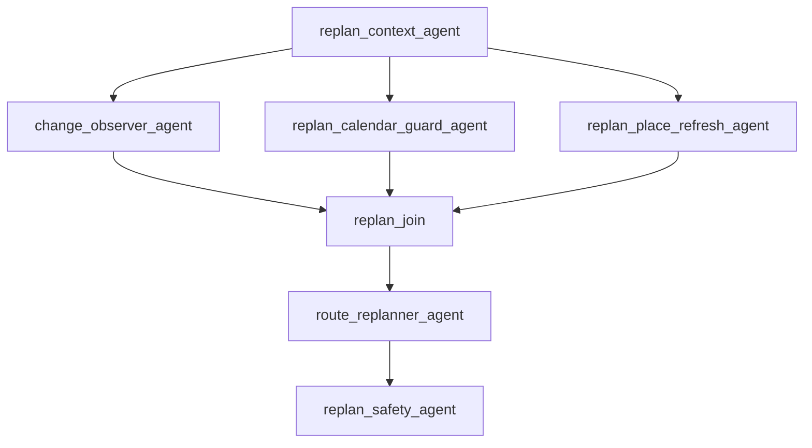
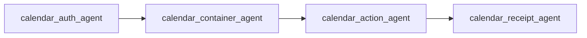

# Google ADK エージェント設計

## 方針

MICHIKUSAは、Geminiへ一度質問してJSONを受け取る構成ではありません。

ADK 2.4のグラフワークフローで、観測、並列探索、経路構成、創作、安全確認、Calendar実行、再計画を別ノードにします。各ノードの開始と完了はイベントとしてUIへ流し、地図上の候補点、ピン、ルート描画へ接続します。

## 計画生成ワークフロー: 18ノード



### 1. situation_agent

- 家か外かを判定
- `departure` / `detour` を決定
- 使える時間と帰宅余白を整理

### 2〜5. 並列Scout

`calendar_scout_agent`
- freeBusyの結果を読む
- 次の予定までの窓を決める

`place_scout_agent`
- Places APIから店、公園、書店、休憩地点を取得
- 過去訪問、距離、営業時間、価格帯で候補を整理

`mobility_scout_agent`
- 徒歩、徒歩＋電車、自転車から探索半径を決める
- 家では広め、外では狭めにする

`memory_scout_agent`
- 最近のルートを読む
- 同じ場所・カテゴリの反復を減らす

### 6. discovery_join

並列Scoutの出力を同期し、次工程へ渡します。

### 7. route_matrix_agent

- 候補ごとの距離と時間を計算
- 組み合わせ候補を比較

### 8. route_composer_agent

- 2〜4地点を選ぶ
- 順番、到着時刻、滞在時間、帰宅時間を決める
- 候補一覧ではなく一つの案へ確定する

### 9. route_geometry_agent

- Routes APIへwaypointを渡す
- polylineとroute pointsを生成
- 地図表示用の経路を作る

### 10. activity_director_agent

Gemini 3.5 Flashが、各地点で行う一つの短い遊びを生成します。

制約:

- 仕事や自己改善タスクにしない
- 一地点につき一つ
- 到着、タイマー、写真、タップのいずれかで完了可能
- 画面一枚に収まる文章

### 11. creative_merge_agent

場所情報とGeminiの遊びを `PlanStop` へ統合します。

### 12. safety_validator_agent

- 営業時間
- 予算
- 時間帯
- 帰宅余白
- ピン数
- 移動負荷

を検査します。

### 13. route_repair_agent

安全検査で不適合があれば、ルート全体を捨てず、該当部分だけを差し替えます。

### 14. final_safety_agent

修正後の帰宅時間と全地点の終了時刻を再検査します。

### 15. calendar_draft_agent

次のイベントへ変換します。

- 移動
- 現地での遊び
- 帰宅

### 16. share_prep_agent

共有カード用に正確な住所を外し、エリア名、距離、時間、LUCKをまとめます。

### 17. memory_narrator_agent

Geminiが短い呼び名を付けます。

### 18. finalizer_agent

`MichikusaPlan` を確定し、UIへ返します。

## 再計画ワークフロー: 7ノード

対象:

- 15分遅れている
- 場所が閉まっている
- 疲れた
- 帰りたい



完了済み地点は保持し、未訪問地点だけを変更します。既にGoogleカレンダーへ登録済みなら、同じevent IDへ更新をかけます。

## Calendar実行ワークフロー: 4ノード



1. OAuth接続を確認
2. MICHIKUSA専用の副カレンダーを取得または作成
3. タイムラインを一括登録または更新
4. event IDとリンクを返す

Calendarへの書き込みは、ユーザーが「この道草で出発」を押した後だけ実行します。

## 入出力

### PlanRequest

- 現在地
- ホーム位置（任意）
- 現在時刻
- 家／外／自動
- 時間、予算、移動手段、気分
- Calendar busy slots
- 過去の場所カテゴリ

### MichikusaPlan

- mode
- title / subtitle
- start / end / return_by
- distance / budget / transport
- stops
- route_points / encoded_polyline
- calendar_events
- safety report
- share card data
- source
- agent version

## 可観測性

各ノードは次のイベントを出します。

```json
{
  "type": "trace",
  "trace": {
    "agent": "place_scout_agent",
    "label": "場所を探す",
    "message": "今から行ける店、公園、書店、休憩場所を探します。",
    "status": "done",
    "color": "pink",
    "metric": "8候補"
  }
}
```

UIでは内部推論を表示しません。何を調べ、何を完了したかだけを表示します。

## フォールバック

実連携時にGeminiまたはMapsが失敗した場合:

1. warning traceを送る
2. 同じADKグラフをデモモデル・デモ地点で再実行
3. `source=fallback` を付ける
4. ユーザーはルート生成を続行できる

Calendar書き込みは、勝手にデモへ切り替えません。OAuthが接続されていない場合はUIで明示し、ルートだけ開始できます。
