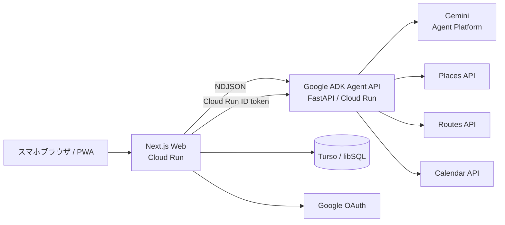

# システム構成

## 1. 全体



WebとAgentを分ける理由:

- Webは公開し、AgentはCloud Run IAMで非公開にできる。
- ADK/PythonとNext.js/Nodeの依存関係を分離できる。
- 地図UIの修正とAgentの評価を独立して行える。
- Agentのタイムアウト、メモリ、同時実行数を別に設定できる。

## 2. リクエスト経路

### 計画生成

```text
Browser
  POST /api/plan/stream
    Next.js
      Calendar freeBusyを取得
      Tursoから直近履歴を取得
      Agent用PlanRequestを作成
      POST /v1/plan/stream
        ADK Workflow
          NDJSONでtrace/candidate/pin/plan
      PlanをTursoへ保存
    Browserへ同じNDJSONを中継
```

### Calendar反映

```text
Browser: この道草で出発
  POST /api/calendar/commit
    OAuth接続とトークン期限を確認
    POST /v1/calendar/commit
      ADK Calendar Workflow
        専用Calendar確認
        events.insert / events.update
        receipt作成
    Calendar IDとevent IDsをTursoへ保存
```

### 再計画

```text
Browser: 遅延 / 休業 / 疲労 / 帰宅
  POST /api/replan
    ADK Replan Workflow
      状況、Calendar guard、場所を並行確認
      残りのPlanを更新
  POST /api/calendar/commit existingEventIds=[...]
    既存Calendarイベントを更新
```

## 3. データ境界

### ブラウザへ送る

- 現在地
- Planと地点
- Agentの短い実行イベント
- Calendar接続状態
- 共有カード情報

### Next.jsサーバーだけで扱う

- OAuth client secret
- Calendar access/refresh token
- Turso auth token
- Agent shared secret
- Cloud Run identity token

### Agentサービスだけで扱う

- Maps server API key
- Gemini/Agent Platformの認証
- Calendar access token（実行時だけ受け取る）

## 4. 永続化

### app_sessions

匿名WebセッションIDを保持します。ログイン機能を作らず、HttpOnly Cookieと結び付けます。

### user_settings

- ホームエリア
- 所要時間
- 予算
- 移動手段
- LUCK合計

### plans

- Plan JSON
- planned / active / completed
- 獲得LUCK
- CalendarイベントID

### oauth_connections

- 暗号化access token
- 暗号化refresh token
- 期限
- scope
- MICHIKUSA Calendar ID

## 5. デモと実運用

| 機能 | デモ | 実運用 |
|---|---|---|
| 地図 | SVGベースの淡い地図 | Maps JavaScript API |
| 場所 | 現在地相対の16候補 | Places API (New) |
| 経路 | Haversine推定 | Routes API |
| Gemini | ADK互換DemoMichikusaModel | Agent Platform上のGemini |
| Calendar | event IDの疑似領収書 | Google Calendar API |
| DB | `file:data/michikusa.db` | Turso |

UIとJSON形状は同じため、環境変数だけで切り替えます。

## 6. Cloud Run

### michikusa-web

- 公開
- Node.js 22
- 768MiB / 1 CPU
- Next.js standalone
- AgentへIDトークン付きで接続

### michikusa-agent

- 非公開
- Python 3.13
- 1GiB / 1 CPU
- FastAPI + Uvicorn
- Google ADK 2.4
- Cloud RunサービスアカウントでAgent Platformへ接続

## 7. 依存障害時

- PlacesかGeminiが失敗した場合、Agent Runtimeは同じグラフをデモモードで再実行する。
- Calendarが未接続でもルート開始を妨げない。
- DB保存が失敗しても、ブラウザ上の完了表示は維持する。
- Agentが応答しない場合はNext.jsが503を返し、UIを待機状態へ戻す。
